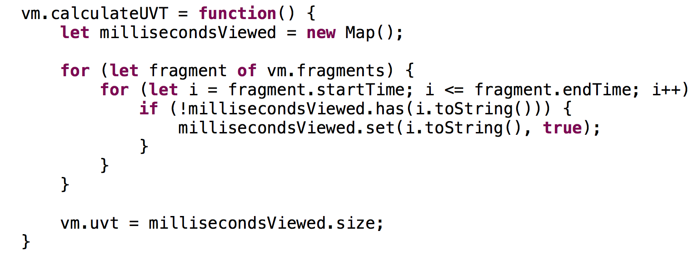

# UVT
An AngularJS app to demo the Unique View Time algorithm.

## In This Document:
1. [Application URL](#application-url)
2. [The UVT Algorithm](#the-uvt-algorithm)

## Application URL
[https://uniqueviewtime.netlify.app/](https://uniqueviewtime.netlify.app/)

## The UVT Algorithm
This is the core algorithm that calculates UVT.

